# Développement d'une solution de pilotage et d'analyse de performance industrielle basée sur la Data Analytics chez Airbus Atlantic Casablanca

**Entreprise :** Airbus Atlantic - Casablanca  
**Auteur :** Yassine BEL-KHSIRY  
**Année universitaire 2023/2024**

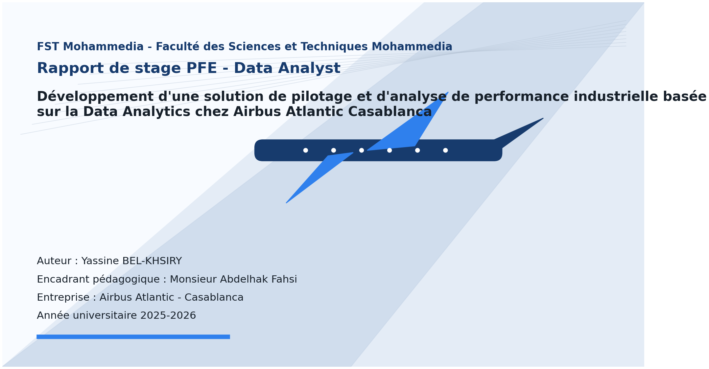

## Sommaire

1. Remerciements
2. Résumé du projet
3. Introduction générale
4. Problématique industrielle
5. Objectifs métier et techniques
6. Technologies utilisées
7. Collecte et présentation des données
8. Nettoyage et préparation
9. Analyse exploratoire
10. Création des KPI industriels
11. Automatisation du reporting
12. Analyse des anomalies
13. Visualisations et interprétations
14. Dashboard industriel
15. Recommandations business
16. Limites du projet
17. Perspectives IA industrielle
18. Annexes techniques

## 1. Remerciements

Je remercie les équipes opérationnelles associées au contexte industriel d'Airbus Atlantic Casablanca pour l'inspiration métier de ce projet : pilotage de la production, suivi qualité, analyse des retards et amélioration continue.

Ce travail m'a permis de consolider une démarche complète de Data Analytics appliquée à l'industrie : compréhension du besoin métier, préparation des données, création d'indicateurs, visualisation et restitution.

## 2. Résumé du projet

Ce rapport présente le développement d'une solution de pilotage industriel basée sur la Data Analytics. Le projet couvre la création d'un pipeline data complet, depuis la préparation des données jusqu'à la restitution sous forme de dashboard et de rapport automatisé.

Les données utilisées sont synthétiques afin de respecter la confidentialité industrielle, tout en reproduisant une structure crédible de données aéronautiques : ordres de fabrication, lignes de production, conformité, délais, anomalies, coûts de non-qualité et signaux machine.

| Indicateur | Valeur |
|---|---:|
| Ordres de fabrication | 12 000 |
| Volume total produit | 755 839 |
| Taux de conformité | 94,7% |
| Taux de retard livraison | 35,0% |
| Coût total de non-qualité | 16 802 280 € |
| Anomalies critiques | 1 769 |

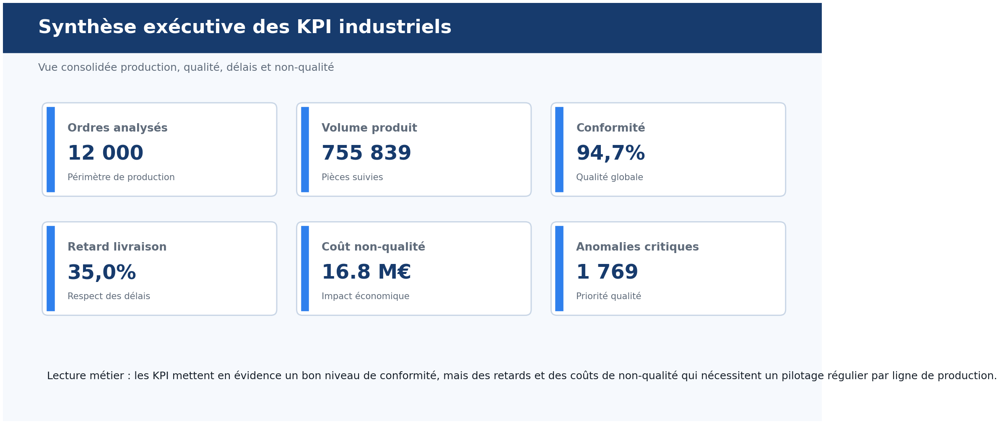

## 3. Introduction générale

Airbus Atlantic Casablanca s'inscrit dans un environnement industriel aéronautique où la qualité, la traçabilité, les délais et la maîtrise des flux sont essentiels. Dans ce type d'organisation, les données de production constituent un levier majeur pour comprendre les écarts, prioriser les actions et sécuriser la performance opérationnelle.

La Data Analytics permet de transformer des données brutes en indicateurs exploitables : taux de conformité, retard livraison, coût de non-qualité, productivité, anomalies critiques et disponibilité machine. Elle contribue aussi à la mise en place d'une culture de pilotage par les faits.

## 4. Problématique industrielle

**Comment exploiter les données industrielles afin d'améliorer le pilotage de la production, détecter les anomalies et optimiser les performances opérationnelles chez Airbus Atlantic Casablanca ?**

Cette problématique implique de structurer les données, fiabiliser les calculs, construire des KPI pertinents, automatiser les visualisations et produire des recommandations compréhensibles par les équipes métier.

## 5. Objectifs métier et techniques

- Automatiser le reporting de performance industrielle.
- Construire un référentiel KPI fiable et reproductible.
- Identifier les retards, anomalies et coûts de non-qualité.
- Fournir un dashboard interactif pour le pilotage.
- Documenter les analyses dans un rapport professionnel de niveau Master / ingénieur.

## 6. Technologies utilisées

| Technologie | Utilisation |
|---|---|
| Python | Pipeline, nettoyage, KPI, rapport |
| Pandas / NumPy | Analyse et transformation des données |
| SQL | Logique d'extraction et agrégation industrielle |
| Matplotlib / Plotly | Visualisations statiques et interactives |
| Streamlit | Dashboard opérationnel |
| Power BI | Référence de reporting métier |
| Markdown / PDF | Documentation portfolio et mémoire |

## 7. Collecte et présentation des données

Le dataset contient 12 000 observations. Chaque ligne représente un ordre de fabrication avec des informations de production, qualité, délai, coût et signaux machine. Les variables couvrent le cycle industriel complet : production, contrôle qualité, livraison, non-conformité et disponibilité machine.

## 8. Nettoyage et préparation

Le nettoyage inclut la conversion des dates, le contrôle des doublons, l'imputation des valeurs manquantes, la cohérence des quantités et la création de variables dérivées : taux de conformité, taux de non-conformité, retard livraison, écart délai, productivité par heure et indicateurs d'anomalies statistiques.

## 9. Analyse exploratoire

L'analyse exploratoire étudie les statistiques descriptives, les valeurs manquantes, les distributions, les corrélations et les anomalies. Elle permet d'identifier les zones de risque et de préparer les indicateurs de pilotage.

## 10. Création des KPI industriels

La ligne générant le coût de non-qualité le plus élevé est **Ligne A350** avec **4 013 857 €**. La ligne avec le taux de retard le plus élevé est **Ligne Composite** avec **40,8%**. L'anomalie la plus fréquente est **Défaut dimensionnel** avec **2 069 occurrences**.

## 11. Automatisation du reporting

Le reporting est automatisé via des scripts Python indépendants : génération des données, nettoyage, calcul KPI, visualisation, dashboard et génération du rapport Markdown/PDF.

## 12. Analyse des anomalies

Les anomalies sont analysées par type, gravité, ligne de production et coût associé. Les anomalies critiques sont mises en avant dans le dashboard afin de faciliter une réaction rapide des équipes qualité et production.

## 13. Visualisations et interprétations

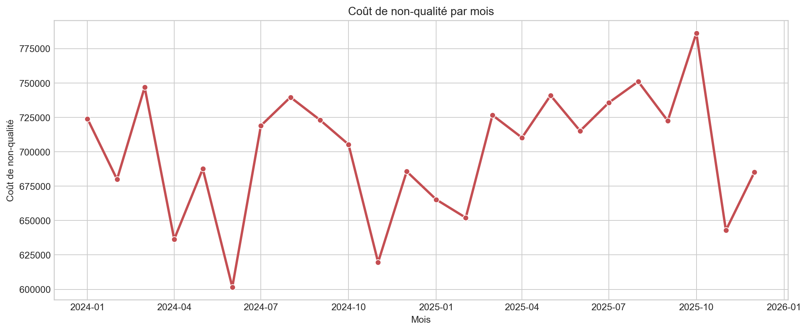
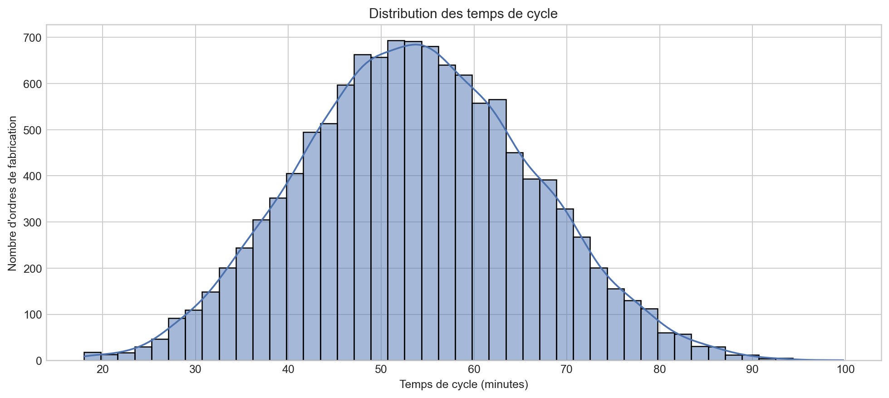
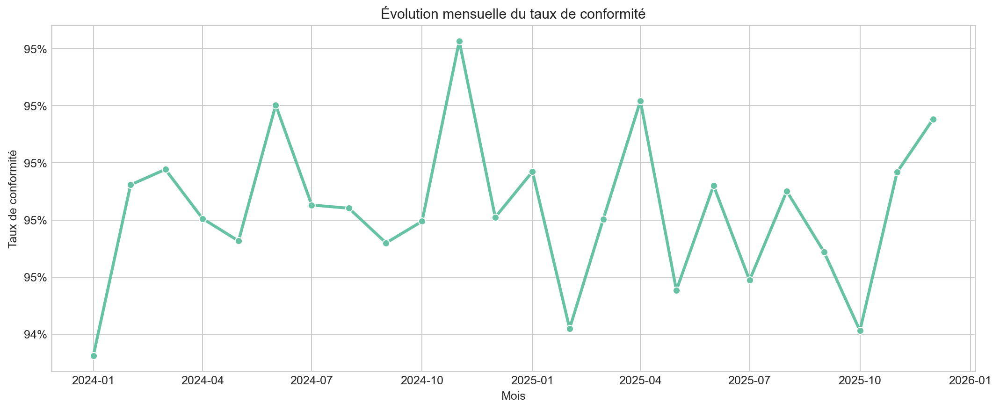
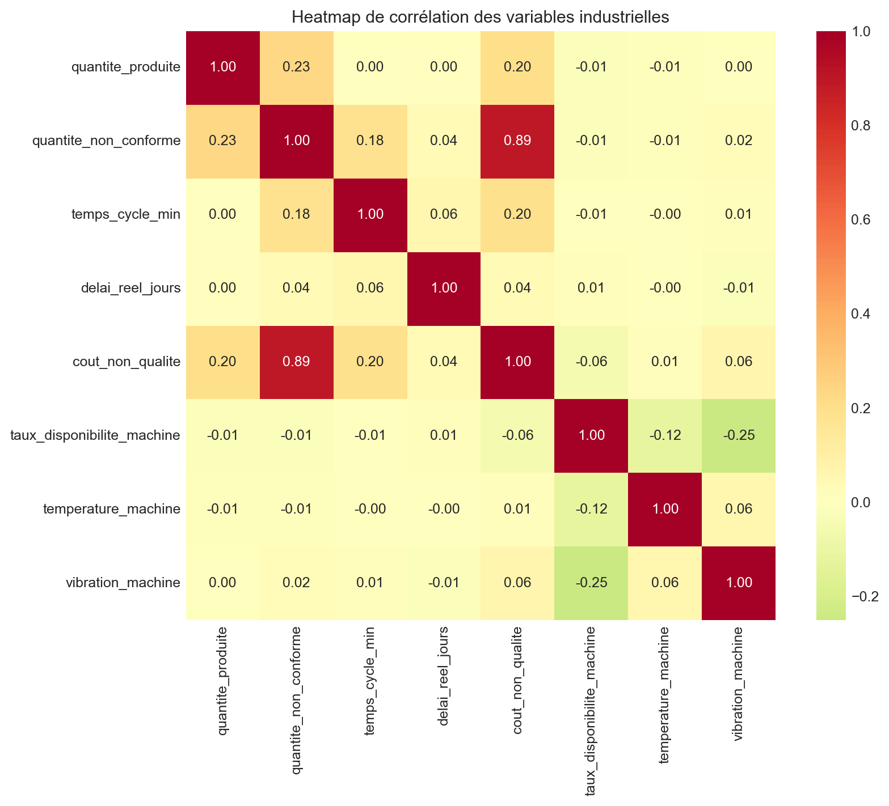
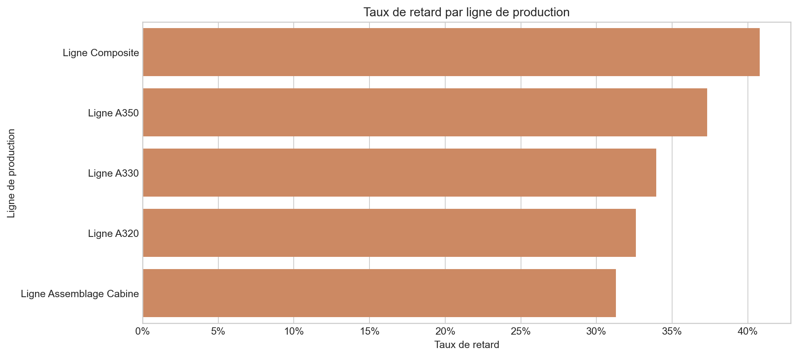
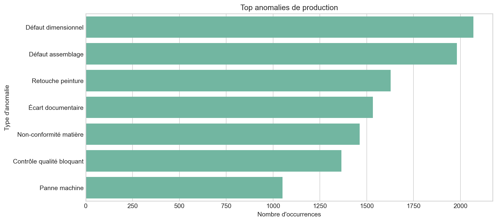
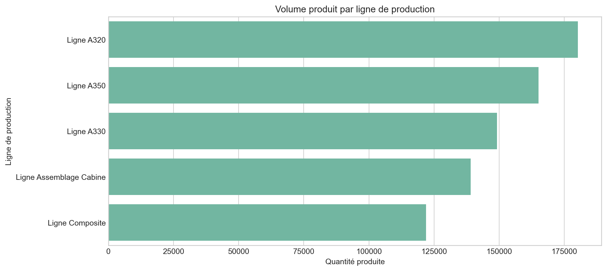

## 14. Dashboard industriel

Le dashboard Streamlit propose des filtres par date, site et ligne de production, des cartes KPI, des graphiques interactifs, un tableau des anomalies critiques et des recommandations métier.

## 15. Recommandations business

- Réduire les anomalies critiques via un rituel qualité-production quotidien.
- Prioriser les lignes cumulant retards et coût de non-qualité.
- Déployer des seuils d'alerte sur conformité, retard et disponibilité machine.
- Exploiter les signaux température et vibration pour initier une logique de maintenance prédictive.
- Connecter le pipeline à une base SQL et à un reporting Power BI cible.

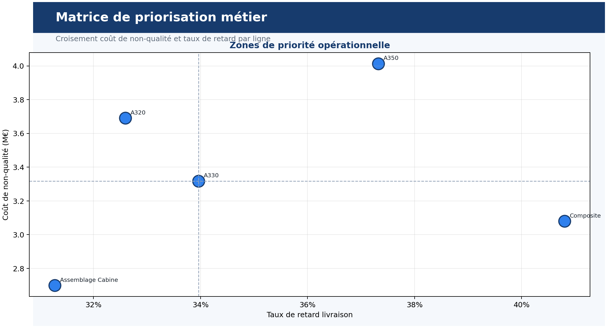

## 16. Limites du projet

Le dataset est synthétique et ne remplace pas une donnée industrielle réelle. Les coûts sont estimés, les dépendances métier sont simplifiées et les recommandations doivent être validées avec les équipes terrain avant déploiement.

## 17. Perspectives IA industrielle

Les perspectives incluent la détection automatique d'anomalies, la prévision des retards, la prédiction du coût de non-qualité, la maintenance prédictive avancée et l'intégration d'un système d'alerte industriel.

## 18. Annexes techniques


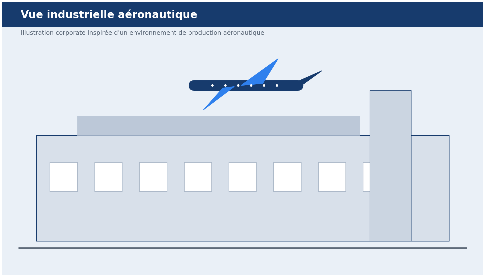

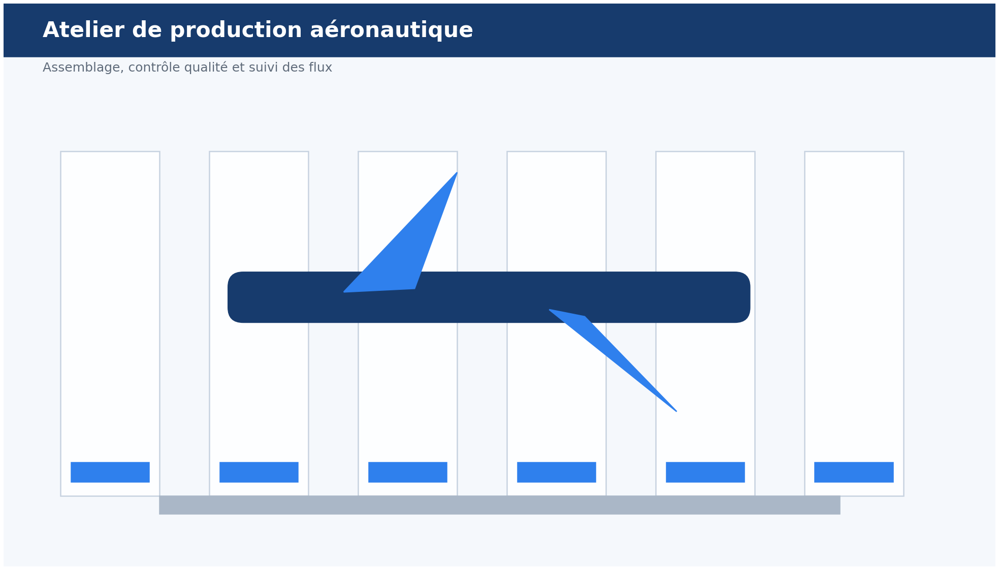

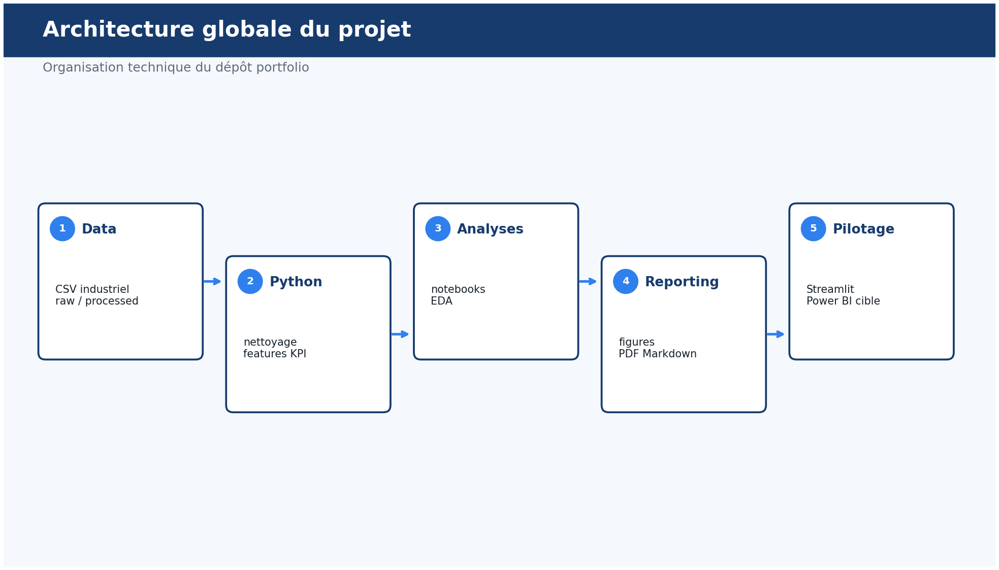

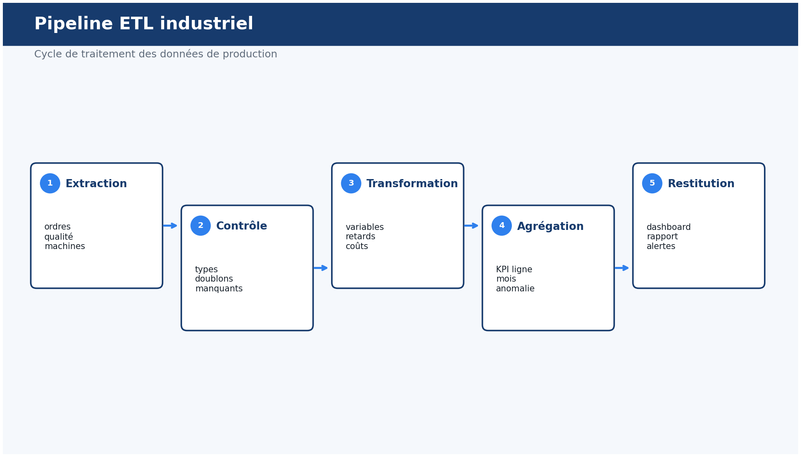

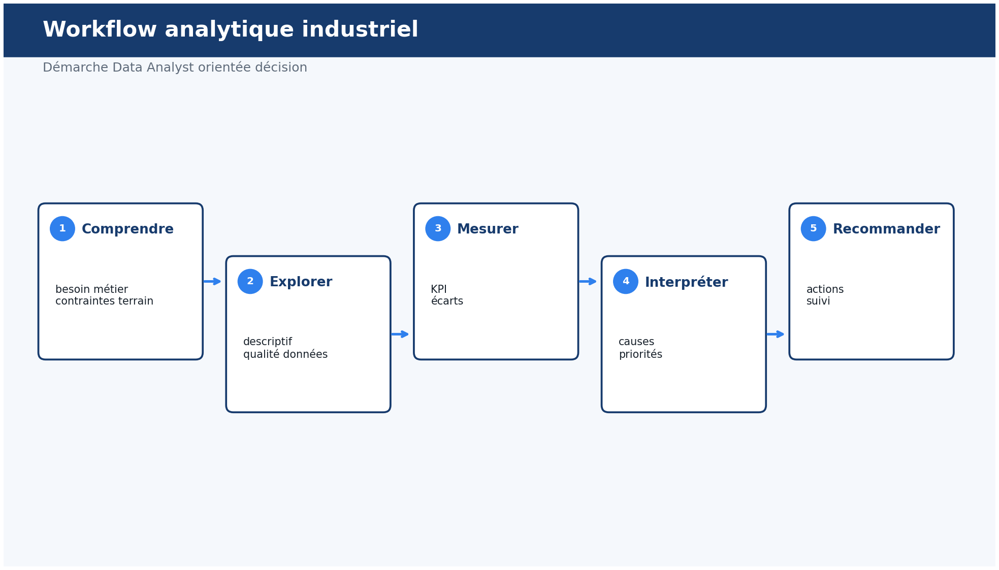

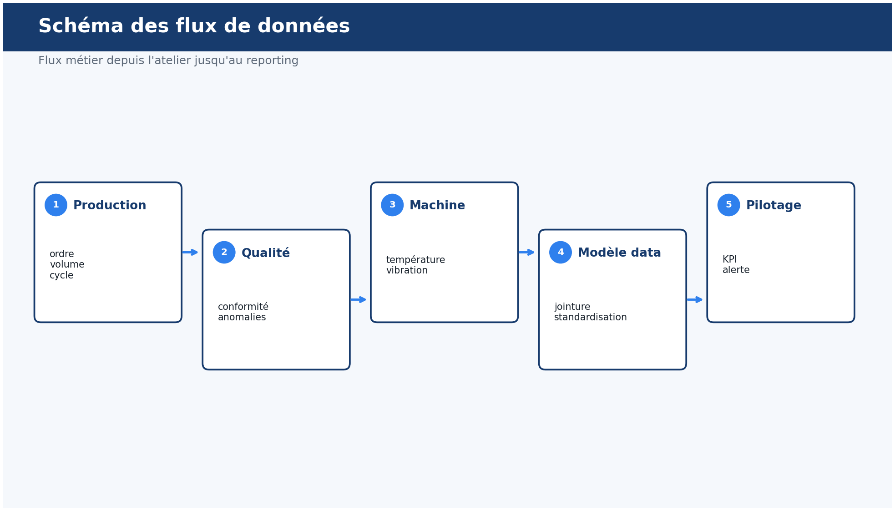

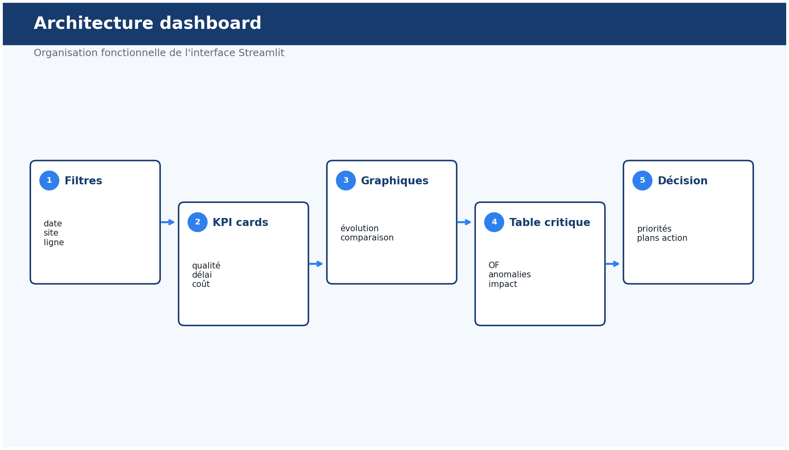


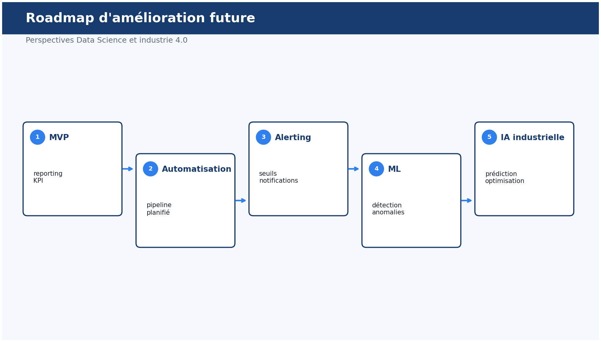

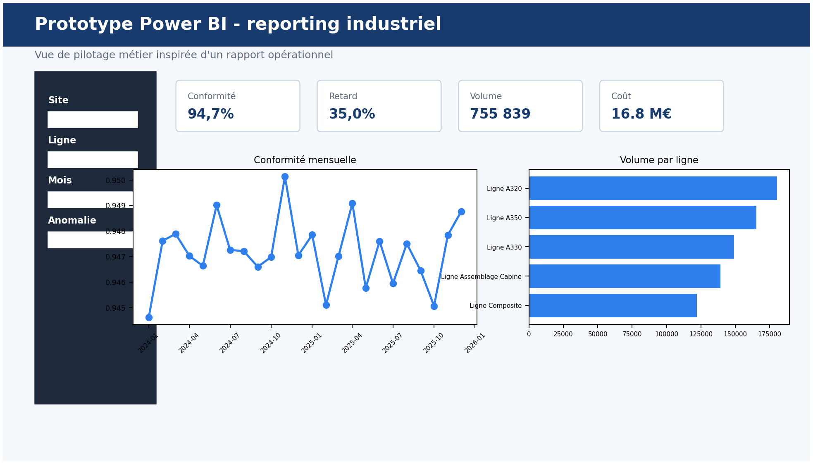

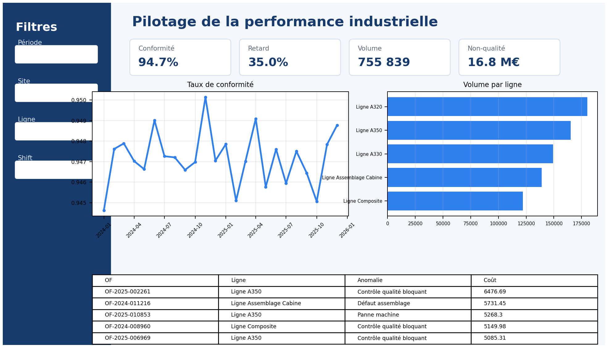

### Structure du projet

```text
data/raw -> data/processed -> src -> reports/figures -> dashboard -> rapport PDF
```

### Extrait de code KPI

```python
taux_conformite = df["quantite_conforme"].sum() / df["quantite_produite"].sum()
taux_retard = df["retard_livraison"].mean()
cout_non_qualite = df["cout_non_qualite"].sum()
```
